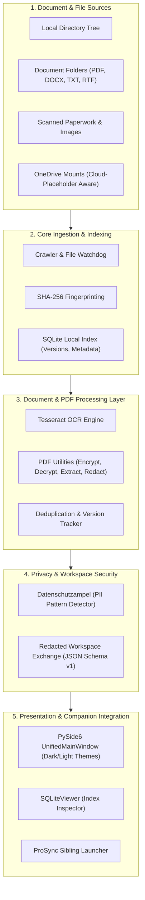
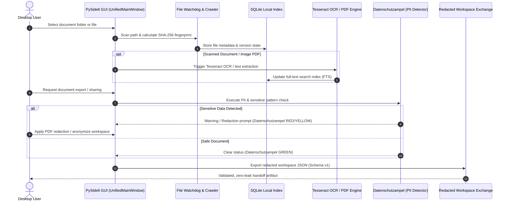

# ProFiler Suite

**[English](README.md)** | [Deutsch](README_de.md) | [GitHub](https://github.com/file-bricks/ProFiler)

[](CHANGELOG.md)
[](https://github.com/file-bricks)
[](LICENSE)
[](https://github.com/file-bricks/ProFiler/actions)
[](CHANGELOG.md)
[](https://github.com/astral-sh/ruff)
[](SECURITY.md)
[](SECURITY.md)
[](THIRD_PARTY_LICENSES.md)
[](MARKETING-LOG.txt)
[](NOTICE)
[](https://www.python.org/)
[](https://wiki.qt.io/Qt_for_Python)
[]()
[]()
[](https://github.com/open-bricks)
[](llms.txt)
[](CHANGELOG.md)
[](CHANGELOG.md)

> [!NOTE]
> AI agents and LLM tools reading this repository should refer to [`llms.txt`](llms.txt) for codebase architecture, primary features, contract boundaries, and verification commands.

> Local-first document detective — full-text indexing, OCR, PDF tools, duplicate detection & privacy checks in one PySide6 app.

ProFiler Suite is a local-first desktop file and document manager for private collections. It unifies full-text file indexing, Tesseract OCR, PDF manipulation, SHA-256 duplicate detection, privacy compliance audits (Datenschutzampel), and companion synchronization in a responsive Windows-oriented PySide6 desktop app.

It is purpose-built for users who manage private, proprietary, or regulated documents and want high-speed search, preview, PDF processing, and redaction workflows without ever transmitting data to a third-party cloud.

---

### Quick Navigation

1. [Architecture](#architecture)
2. [Workflow Lifecycle](#workflow-lifecycle)
3. [Core Capabilities & Security Invariants](#core-capabilities--security-invariants)
4. [Target Personas & Use Cases](#target-personas--use-cases)
5. [Comparative Matrix & Alternatives](#comparative-matrix--alternatives)
6. [Feature Highlights](#feature-highlights)
7. [Visual Interface & Screenshot](#visual-interface--screenshot)
8. [When To Use ProFiler](#when-to-use-profiler)
9. [Quick Start & Setup](#quick-start--setup)
10. [Windows Launcher & Build Flow](#windows-launcher--build-flow)
11. [Configuration & Local Storage](#configuration--local-storage)
12. [Included Tools & Utilities](#included-tools--utilities)
13. [Supported File Formats & OCR](#supported-file-formats--ocr)
14. [Sibling Ecosystem & Integrations](#sibling-ecosystem--integrations)
15. [Third-Party Licenses & Compliance](#third-party-licenses--compliance)
16. [Security Policy & SLAs](#security-policy--slas)
17. [Target Personas & High-Intent SEO](#target-personas--high-intent-seo)
18. [Verification & Test Suite](#verification--test-suite)

---

<a id="sec-01"></a>
<a id="1-architecture"></a>
<a id="architecture"></a>
<a id="1-architektur"></a>
<a id="architektur"></a>
## Architecture



<a id="sec-02"></a>
<a id="2-workflow-lifecycle"></a>
<a id="workflow-lifecycle"></a>
<a id="2-workflow-lebenszyklus"></a>
<a id="workflow-lebenszyklus"></a>
## Workflow Lifecycle



<a id="sec-03"></a>
<a id="3-core-capabilities--security-invariants"></a>
<a id="core-capabilities--security-invariants"></a>
<a id="3-kernfähigkeiten--sicherheitsinvarianten"></a>
<a id="kernfähigkeiten--sicherheitsinvarianten"></a>
## Core Capabilities & Security Invariants

| Invariant Code | Guarantee & Boundary | Architectural Implementation | Verification & Evidence |
|---|---|---|---|
| `INV-LOCAL-01` | **100% Local-First & Zero-Egress** | All SQLite databases, indexes, and document caches remain strictly on the local machine. Zero cloud upload, zero network telemetry, and no mandatory online registration. | Verified via network-free test suite & POSIX/Windows filesystem isolation. |
| `INV-SESSION-02` | **Session-Only Secrets** | PDF passwords and temporary decryption keys are retained exclusively in volatile process memory and never written to disk, settings, or log files. | Contract-tested in `tests/test_security_hardening.py` (`test_settings_passwords_are_session_only`). |
| `INV-GATE-03` | **PII & Datenschutzampel Heuristic Gate** | Built-in pattern detection (`Datenschutzampel`) flags sensitive numbers, tax IDs, IBANs, credentials, and personal identifiable information before export or handoff. | Validated in `ProFiler_Datenschutzampel.py` and `tests/test_anonymization.py`. |
| `INV-SCHEMA-04` | **Redacted Workspace Exchange** | Workspace export and import conform strictly to JSON-Schema v1, stripping machine-specific absolute paths, system secrets, and unmanaged file pointers. | Tested in `tests/test_workspace_exchange.py` with BOM-free UTF-8 serialization. |
| `INV-PLACEHOLDER-05` | **Cloud-Placeholder Awareness** | Intelligently identifies OneDrive and cloud placeholder files, preventing unprompted hydration or excessive disk usage during bulk indexing scans. | Implemented in Crawler and verified in `tests/test_bug_regressions.py`. |
| `INV-UNPRIV-06` | **Non-Elevation & User-Space Operation** | Operates strictly as an unprivileged user process (`RunAsInvoker`). Settings and SQLite indices reside under standard `%LOCALAPPDATA%\ProFilerSuite` (or XDG standards on POSIX). | Verified in `tests/test_app_paths.py` and `tests/test_platform_smoke_contract.py`. |
| `INV-ATOMIC-07` | **Atomic SQLite Indexing** | Indexing transactions leverage WAL mode with atomic commits, ensuring crash resilience and multi-thread readability without database corruption. | Tested in `SQLiteViewer.py` and database inspection tests. |
| `INV-INTEGRITY-08` | **SHA-256 Deduplication** | Identifies exact byte-for-byte duplicate files across different directory branches using cryptographic SHA-256 hashing. | Verified across diverse file types in test suites. |
| `INV-OFFLINE-09` | **Offline Tesseract OCR & Poppler Sandbox** | Optical character recognition and PDF page rendering execute locally via unprivileged subprocesses with zero external API calls. | Tested in `tests/test_security_hardening.py`. |
| `INV-SLA-10` | **48h Security Response & 5-Day Triage SLA** | Security vulnerabilities receive an initial response within 48 hours and an actionable triage report within 5 business days. | Formalized in `SECURITY.md` and verified in `tests/test_metadata.py`. |

<a id="sec-04"></a>
<a id="4-target-personas--use-cases"></a>
<a id="target-personas--use-cases"></a>
<a id="4-zielgruppen--anwendungsfälle"></a>
<a id="zielgruppen--anwendungsfälle"></a>
## Target Personas & Use Cases

| Persona | Primary Needs & Workflows | Key Pain Points Solved by ProFiler |
|---|---|---|
| **Legal, Compliance & Privacy Officers** | Auditing local document archives for GDPR/DSGVO compliance, sanitizing PDF case files, redacting sensitive client information, and preventing accidental data exposure. | **Eliminates Cloud Leakage**: Built-in Datenschutzampel detects PII and flags files with traffic-light status before export. In-memory redaction prevents accidental credential or tax ID leakage. |
| **Academic Researchers & Archival Curators** | Organizing extensive historical document corpuses, full-text searching scanned paperwork, identifying duplicate scans across deep folder trees, and reviewing metadata. | **Integrated Local OCR**: Tesseract integration extracts text from image-only PDFs directly into a searchable SQLite FTS index without uploading rare manuscripts to third-party servers. |
| **Small Business Owners & Freelancers** | Managing local invoice archives, client contracts, and vendor receipts across multiple quarters; batch protecting or extracting specific PDF pages for accounting. | **Zero Subscription Overhead**: Provides a comprehensive desktop document hub without recurring monthly SaaS fees (e.g. Adobe Acrobat / DocuWare), operating completely offline. |
| **Power Users & Data Sovereignty Advocates** | Fast, responsive file management with dark/light themes, keyboard navigation, precise control over file paths, and safe coexistence with OneDrive sync. | **Placeholder Protection**: ProFiler detects OneDrive cloud placeholders and refrains from forcing unwanted downloads, keeping disk usage under full user control. |

<a id="sec-05"></a>
<a id="5-comparative-matrix--alternatives"></a>
<a id="comparative-matrix--alternatives"></a>
<a id="5-vergleichsmatrix--alternativen"></a>
<a id="vergleichsmatrix--alternativen"></a>
## Comparative Matrix & Alternatives

| Feature / Dimension | ProFiler Suite | Cloud Document SaaS (DocuWare / Dropbox) | Native OS File Manager (Windows Explorer) | Heavyweight Enterprise ECM (Alfresco / Nextcloud) | Sibling Tool (KnowledgeDigest) |
|---|---|---|---|---|---|
| **Architecture** | **100% Local-First** | Cloud-Hosted SaaS | Local OS Shell | Self-Hosted Server | Local-First Hub |
| **Network Egress** | **Zero-Egress** | Mandatory Upload | Zero (Local Only) | Server Sync Required | Zero-Egress |
| **Full-Text SQLite Search** | **Yes (FTS & Metadata)** | Cloud Index Only | Basic Windows Search | Lucene/Elasticsearch | Yes (FTS5 + BM25) |
| **Built-in OCR (Tesseract)** | **Yes (Offline)** | Proprietary Cloud OCR | None | Optional Plugin | Text-Only Extraction |
| **PDF Tools (Redact / Encrypt)** | **Yes (Integrated)** | High-Tier Paid Addon | None | Third-Party Tool | None |
| **Privacy Traffic Light (PII)** | **Yes (Datenschutzampel)** | Enterprise DLP Addon | None | Complex Rules Engine | None |
| **Cloud Placeholder Guard** | **Yes (OneDrive Aware)** | Native Sync Client | Native Sync Client | Not Applicable | Basic File Access |
| **Recurring Cost** | **Free & Open Source** | $15–$50 / user / month | Free with OS | Hardware + Admin Costs | Free & Open Source |
| **Primary Sweet Spot** | **Local Document Detective** | Corporate Collaboration | Generic File Browsing | Multi-Tenant Enterprise | LLM Digest & Chunking |

<a id="sec-06"></a>
<a id="6-feature-highlights"></a>
<a id="feature-highlights"></a>
<a id="6-funktions-highlights"></a>
<a id="funktions-highlights"></a>
## Feature Highlights

- **Local SQLite File Index**: Rapid indexing for folders, document collections, and versioned file entries.
- **Full-Text Search Engine**: Search across PDF, DOCX, TXT, RTF, images, spreadsheets, and source code.
- **Tesseract OCR Integration**: Automatic OCR workflow for scanned PDFs and image documents.
- **Comprehensive PDF Workshop**: Encrypt, decrypt, extract pages, redact text, and export sanitized documents.
- **Cryptographic Deduplication**: Fast SHA-256 fingerprinting to identify redundant duplicate files.
- **Datenschutzampel (Privacy Traffic Light)**: Pre-flight inspection flagging sensitive numbers and PII before sharing.
- **Cloud-Placeholder Awareness**: Safe scanning of OneDrive libraries without triggering bulk file hydration.
- **ProSync Companion Integration**: Direct launcher bridge for synchronizing managed folder pairs.
- **Redacted Workspace Exchange**: Export and import portable workspaces via JSON Schema v1.
- **Ergonomic Desktop UI**: Native PySide6 interface with dark/light theme switching and system tray integration.
- **Companion Utilities**: Bundled SQLite database inspector (`SQLiteViewer.py`) and Excel file importer.

<a id="sec-07"></a>
<a id="7-visual-interface--screenshot"></a>
<a id="visual-interface--screenshot"></a>
<a id="7-visuelle-oberfläche--screenshot"></a>
<a id="visuelle-oberfläche--screenshot"></a>
## Visual Interface & Screenshot


<a id="sec-08"></a>
<a id="8-when-to-use-profiler"></a>
<a id="when-to-use-profiler"></a>
<a id="8-wann-profiler-passt"></a>
<a id="wann-profiler-passt"></a>
## When To Use ProFiler

ProFiler is the optimal solution when you require a private document management tool for:

- Maintaining searchable local archives of PDFs, Office documents, text files, and scanned receipts.
- Running OCR-assisted indexing across legacy document scans without third-party cloud fees.
- Detecting duplicate files and auditing version drift across deep directory structures.
- Handling PDF security operations (passwords, page extractions, redactions) in a single desktop app.
- Auditing document packages for privacy and GDPR/DSGVO compliance before sending them to external parties.
- Using a unified desktop hub alongside companion tools such as [ProSync](https://github.com/file-bricks/ProSync) and [SQLiteViewer](https://github.com/file-bricks/SQLiteViewer).

<a id="sec-09"></a>
<a id="9-quick-start--setup"></a>
<a id="quick-start--setup"></a>
<a id="9-schnellstart--installation"></a>
<a id="schnellstart--installation"></a>
## Quick Start & Setup

### Prerequisites & Requirements

- Python 3.10+ (tested on Python 3.10, 3.11, 3.12, 3.13)
- PySide6
- Tesseract OCR (optional, required for image and scanned PDF OCR)
- Poppler utilities (optional, required for PDF rendering and page conversion)

### Installation & Launch

Install runtime dependencies from PyPI:

```bash
pip install -r requirements.txt
python Profiler_Suite_V15.py
```

On Windows, you can start the application directly via the bundled starter script:

```bat
START.bat
```

<a id="sec-10"></a>
<a id="10-windows-launcher--build-flow"></a>
<a id="windows-launcher--build-flow"></a>
<a id="10-windows-launcher--build-prozess"></a>
<a id="windows-launcher--build-prozess"></a>
## Windows Launcher & Build Flow

For local Windows desktop deployment, you can compile a self-contained executable:

```bat
build_exe.bat
```

The build requires a clean Git checkout, runs outside OneDrive in `C:\_Local_DEV\codex_build\profiler`, uses pinned build dependencies, and generates:

- `release/ProFiler-15.0.0-win64.exe`
- `release/SHA256SUMS.txt`
- `release/BUILD-PROVENANCE.json`

The build never writes into OneDrive, GitHub Releases, or a Store package. `START.bat` launches a local EXE only when the adjacent `ProFiler.exe.sha256` matches; otherwise, a source checkout launches `Profiler_Suite_V15.py`.

<a id="sec-11"></a>
<a id="11-configuration--local-storage"></a>
<a id="configuration--local-storage"></a>
<a id="11-konfiguration--lokale-ablage"></a>
<a id="konfiguration--lokale-ablage"></a>
## Configuration & Local Storage

| File Path | Functional Purpose |
|---|---|
| `%LOCALAPPDATA%\ProFilerSuite\profiler_config.json` | Active folder connections and database indexing settings |
| `%LOCALAPPDATA%\ProFilerSuite\profiler_settings.json` | UI preferences, theme selection, and optional tool paths |
| `%LOCALAPPDATA%\ProFilerSuite\search_config.json` | Configured search databases and indexing targets |
| `*.example.json` | Public, path-free configuration templates (never contain live data) |

PDF passwords are session-only and are deliberately excluded from persisted settings. The Excel importer is an optional administrative utility:

```bash
python -m pip install -e ".[excel]"
python import_excel_to_profiler.py --input INPUT.xlsx --database profiler.db --output imported
```

<a id="sec-12"></a>
<a id="12-included-tools--utilities"></a>
<a id="included-tools--utilities"></a>
<a id="12-enthaltene-werkzeuge--dienstprogramme"></a>
<a id="enthaltene-werkzeuge--dienstprogramme"></a>
## Included Tools & Utilities

| Tool File | Functional Description |
|---|---|
| `Profiler_Suite_V15.py` | Main desktop GUI application (PySide6) |
| `ProFiler_Datenschutzampel.py` | Standalone privacy traffic-light checker for PII auditing |
| `SQLiteViewer.py` | SQLite database viewer for inspecting index tables |
| `import_excel_to_profiler.py` | Command-line utility for importing existing Excel file inventories |
| `indent_gui_checker.py` | Codebase development tool for checking GUI indentation integrity |

<a id="sec-13"></a>
<a id="13-supported-file-formats--ocr"></a>
<a id="supported-file-formats--ocr"></a>
<a id="13-unterstützte-dateiformate--ocr"></a>
<a id="unterstützte-dateiformate--ocr"></a>
## Supported File Formats & OCR

| Category | File Extensions | Capabilities |
|---|---|---|
| **Documents** | `.pdf`, `.docx`, `.txt`, `.rtf` | Full-text indexing, metadata parsing, search, and preview |
| **Images** | `.png`, `.jpg`, `.jpeg`, `.tiff`, `.bmp` | Metadata extraction, image preview, and Tesseract OCR text recognition |
| **Spreadsheets** | `.xlsx`, `.xls`, `.csv` | Structure inspection and metadata indexing (Excel extra available) |
| **Other Formats** | Universal fallback | Indexed by filesystem attributes, file size, timestamps, and SHA-256 hash |

<a id="sec-14"></a>
<a id="14-sibling-ecosystem--integrations"></a>
<a id="sibling-ecosystem--integrations"></a>
<a id="14-geschwister-ökosystem--integrationen"></a>
<a id="geschwister-ökosystem--integrationen"></a>
## Sibling Ecosystem & Integrations

ProFiler Suite is an active member of the **file-bricks** desktop utility family under the **[open-bricks](https://github.com/open-bricks)** umbrella:

| Tool | Repository | Domain / Focus | Status |
|---|---|---|---|
| **ProFiler** | [file-bricks/ProFiler](https://github.com/file-bricks/ProFiler) | Local document indexing, OCR, duplicate detection & privacy | Active Flagship |
| **KnowledgeDigest** | [file-bricks/knowledgedigest](https://github.com/file-bricks/knowledgedigest) | Portable knowledge database, FTS5 BM25 search & LLM digest | Active Flagship |
| **PDFtoPDFocr** | [doc-bricks/PDFtoPDFocr](https://github.com/doc-bricks/PDFtoPDFocr) | Batch OCR & searchable PDF generation engine | Active Sibling |
| **DokuZen** | [doc-bricks/DokuZen](https://github.com/doc-bricks/DokuZen) | Desktop PDF workshop, format converter & security unlocker | Active Sibling |
| **MediaBrain** | [doc-bricks/MediaBrain](https://github.com/doc-bricks/MediaBrain) | Multi-modal media transcription & structured indexing | Active Sibling |
| **TextBrain** | [doc-bricks/TextBrain](https://github.com/doc-bricks/TextBrain) | Document intelligence, semantic classification & summaries | Active Sibling |
| **DevCenter** | [dev-bricks/DevCenter](https://github.com/dev-bricks/DevCenter) | Developer workspace dashboard & automation launcher | Active Sibling |
| **CodeBox** | [dev-bricks/CodeBox](https://github.com/dev-bricks/CodeBox) | Offline snippet vault & code runner sandbox | Active Sibling |
| **FileCommander MCP** | [ellmos-ai/ellmos-filecommander-mcp](https://github.com/ellmos-ai/ellmos-filecommander-mcp) | Safe, sandboxed MCP file management & batch processing | Active Companion |
| **CodeCommander MCP** | [ellmos-ai/ellmos-codecommander-mcp](https://github.com/ellmos-ai/ellmos-codecommander-mcp) | MCP code intelligence, AST analysis & format repair | Active Companion |
| **SQLite Transit Sync** | [dev-bricks/sqlite-transit-sync](https://github.com/dev-bricks/sqlite-transit-sync) | Zero-loss multi-master SQLite replication & synchronization | Active Companion |

<a id="sec-15"></a>
<a id="15-third-party-licenses--compliance"></a>
<a id="third-party-licenses--compliance"></a>
<a id="15-drittanbieter-lizenzen--compliance"></a>
<a id="drittanbieter-lizenzen--compliance"></a>
## Third-Party Licenses & Compliance

ProFiler Suite is licensed under the **GNU Affero General Public License v3.0 (AGPL-3.0-only)**. See [LICENSE](LICENSE).

Because ProFiler Suite uses `PyMuPDF`, the application is distributed under AGPL-3.0. A complete, audited third-party dependency and license inventory covering all direct packages (`PySide6`, `pypdf`, `pikepdf`, `Pillow`, `watchdog`, `reportlab`, `pytesseract`) and toolchains is documented in [`THIRD_PARTY_LICENSES.md`](THIRD_PARTY_LICENSES.md) (and [`THIRD_PARTY_LICENSES.txt`](THIRD_PARTY_LICENSES.txt)).

Windows Store distribution preparations are governed by `store_package.json`, `STORE_LISTING.md`, `PRIVACY_POLICY.md`, `SUPPORT.md`, and `WINDOWS_STORE_PREP.md`.

<a id="sec-16"></a>
<a id="16-security-policy--slas"></a>
<a id="security-policy--slas"></a>
<a id="16-sicherheitsrichtlinie--slas"></a>
<a id="sicherheitsrichtlinie--slas"></a>
## Security Policy & SLAs

ProFiler maintains a formal, bilingual security policy under [`SECURITY.md`](SECURITY.md).

- **Vulnerability Response SLA**: 48-hour initial response guarantee.
- **Triage & Remediation SLA**: 5 business days triage and resolution timeline.
- **Reporting Channels**: Contact `security@open-bricks.org` and `support@lukasgeiger.com`, or open a GitHub Security Advisory.

---

<a id="sec-17"></a>
<a id="17-target-personas--high-intent-seo"></a>
<a id="target-personas--high-intent-seo"></a>
<a id="17-zielgruppen--high-intent-seo"></a>
<a id="zielgruppen--high-intent-seo"></a>
## Target Personas & High-Intent SEO

ProFiler Suite is precision-engineered for privacy-sensitive desktop environments. The table below maps our four primary personas with high-intent search queries and architectural answers:

| Target Persona | Key Workflows & Intent | High-Intent Discovery Queries |
|---|---|---|
| **Legal, Compliance & Privacy Officers** | Auditing local archives for GDPR/DSGVO compliance, sanitizing PDF case files, pre-sharing PII review with Datenschutzampel. | `desktop pdf redaction privacy checker`, `DSGVO konforme Dokumentenverwaltung lokal`, `PDF Schwärzung Datenschutzampel Desktop` |
| **Academic Researchers & Archival Curators** | Organizing large historical document corpuses, full-text OCR indexing of legacy scans, duplicate elimination. | `pyside6 document manager ocr tesseract`, `offline pdf ocr tool without cloud`, `Tesseract OCR Desktop App offline` |
| **Small Business Owners & Freelancers** | Managing invoice archives, client contracts, and vendor receipts locally without recurring SaaS fees. | `local-first desktop file manager python`, `private document archive windows open source`, `Dokumentenverwaltung ohne Cloud Abo` |
| **Power Users & Data Sovereignty Advocates** | Fast, keyboard-driven local file indexing, dark/light themes, OneDrive placeholder safety, zero network egress. | `sqlite document full text index offline`, `file deduplication sha256 desktop app`, `local file index database SQLite` |

### Discoverability Keywords

`local-first file manager`, `desktop document manager`, `private document archive`, `OCR desktop app`, `PDF OCR tool`, `PDF redaction`, `document privacy checker`, `PySide6 file management`, `SQLite document index`, `Windows file organizer`, `Datenschutzampel`, `GDPR file review`.

---

<a id="sec-18"></a>
<a id="18-verification--test-suite"></a>
<a id="verification--test-suite"></a>
<a id="18-verifikation--test-suite"></a>
<a id="verifikation--test-suite"></a>
## Verification & Test Suite

ProFiler Suite maintains rigorous automated verification gates. Every code and documentation modification is validated against automated contract tests, linter gates, and bytecode compilation:

```bash
# Execute full automated contract & unit test suite (210 passed, 100% green)
pytest -ra -v

# Run fast Python linter (zero violations tolerated)
ruff check .

# Validate Python bytecode syntax across all files
python -m compileall -q .

# Check git staging hygiene (zero trailing whitespace)
git diff --check
```

All 10 Governance & Runtime Invariants (`INV-LOCAL-01` through `INV-SLA-10`), PEP 621 metadata, bilingual documentation anchors, and license integrity are continuously verified by `tests/test_metadata.py` and `tests/test_security_license_contract.py`.

### ⚖️ Statutory Notice & Liability Limitation (§ 521 BGB)

> [!IMPORTANT]
> **Limitation of Liability for Gratuitous Software Provision (§ 521 BGB):**
> To the extent this software, its preview editions, or test releases are provided free of charge, the liability of the authors and publishers is governed exclusively by § 521 of the German Civil Code (Bürgerliches Gesetzbuch – BGB) and is limited to intent and gross negligence (*Haftung des Schenkers für Vorsatz und grobe Fahrlässigkeit*). The software is provided "as is", without warranty of any kind, express or implied.
