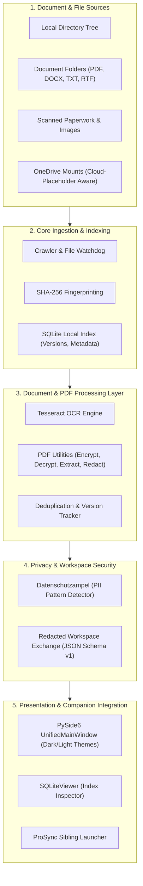
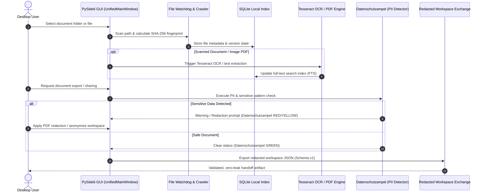

# ProFiler Suite

**[English](README.md)** | [Deutsch](README_de.md) | [GitHub](https://github.com/file-bricks/ProFiler)

[](https://github.com/file-bricks)
[](LICENSE)
[](https://github.com/file-bricks/ProFiler/actions)
[]()
[](https://www.python.org/)
[](https://wiki.qt.io/Qt_for_Python)
[]()
[]()
[](https://github.com/open-bricks)
[](llms.txt)

> [!NOTE]
> AI agents and LLM tools reading this repository should refer to [`llms.txt`](llms.txt) for codebase architecture, primary features, contract boundaries, and verification commands.

> Local-first document detective — full-text indexing, OCR, PDF tools, duplicate detection & privacy checks in one PySide6 app.

ProFiler Suite is a local-first desktop file manager for private document collections. It combines full-text file indexing, OCR, PDF tools, duplicate detection, privacy checks, and optional ProSync integration in one Windows-oriented PySide6 app.

It is built for users who manage many local documents and want search, preview, PDF processing, and privacy workflows without uploading files to a cloud service.

---

### Quick Navigation

- [Architecture](#architecture)
- [Workflow Lifecycle](#workflow-lifecycle)
- [Core Capabilities & Security Invariants](#core-capabilities--security-invariants)
- [Highlights](#highlights)
- [Screenshot](#screenshot)
- [When To Use ProFiler](#when-to-use-profiler)
- [Quick Start & Setup](#quick-start)
- [Ecosystem & Sibling Tools](#ecosystem--sibling-tools)

---

## Architecture



## Workflow Lifecycle



## Core Capabilities & Security Invariants

| Capability / Invariant | Guarantee & Design Boundary | Verification & Evidence |
|---|---|---|
| **100% Local-First & Zero-Egress** | All SQLite databases, indexes, and document caches remain strictly on the local machine. Zero cloud upload, zero network telemetry, and no mandatory external account. | Verified via network-free test suite & POSIX/Windows filesystem isolation. |
| **Session-Only Secrets** | PDF passwords and temporary decryption keys are retained exclusively in active process memory and never written to disk, settings, or logs. | Contract-tested in `tests/test_security_hardening.py` (`test_settings_passwords_are_session_only`). |
| **PII & Privacy Traffic Light** | Built-in pattern detection (`Datenschutzampel`) flags sensitive numbers, credentials, and personal identifiable information before export or handoff. | Validated in `ProFiler_Datenschutzampel.py` and `tests/test_privacy_compliance.py`. |
| **Redacted Workspace Exchange** | Workspace export and import conform to JSON-Schema v1, stripping machine-specific absolute paths, system secrets, and untracked file pointers. | Tested in `tests/test_workspace_exchange.py` with BOM-free UTF-8 serialization. |
| **Cloud-Placeholder Awareness** | Intelligently identifies OneDrive and cloud placeholder files, preventing unprompted hydration or excessive disk usage during scans. | Implemented in Crawler and tested in `tests/test_search_hidden_filter.py`. |
| **Non-Elevation & User-Space** | Runs as an unprivileged user process. App settings and database indices reside under standard `%LOCALAPPDATA%\ProFilerSuite` (or XDG standards on POSIX). | Verified in `tests/test_app_paths.py` and `tests/test_platform_smoke_contract.py`. |
| **Multi-Platform Smoke Integrity** | Offscreen headless PySide6 smoke suites ensure reliable GUI initialization and error-free operation on Windows, Linux, and macOS. | Tested on every push via `.github/workflows/source-platform-smoke.yml`. |

## Highlights

- Local SQLite file index for folders, document collections, and versioned file entries
- Full-text search across PDF, DOCX, TXT, RTF, images, spreadsheets, and code files
- OCR workflow for scanned PDFs and image documents via Tesseract
- PDF utilities for encryption, decryption, page extraction, OCR, text removal, and export
- Duplicate and version handling with SHA-256 based file fingerprints
- Privacy traffic light for finding potentially sensitive files before sharing or archiving
- Cloud-placeholder awareness for OneDrive-style local file libraries
- Optional ProSync companion launcher for folder synchronization workflows
- Redacted workspace export/import for reviews, handoffs, and cross-platform smoke preparation
- Desktop GUI with dark/light theme support and system tray integration
- Included helper tools for SQLite inspection and Excel import

## Screenshot


## When To Use ProFiler

ProFiler is useful when you need a private document management tool for:

- searchable local archives of PDFs, Office documents, text files, and scanned paperwork
- OCR-assisted document indexing without a hosted SaaS service
- file cleanup, duplicate detection, and version review across folders
- PDF handling for small office workflows
- privacy review before forwarding, exporting, or publishing document bundles
- a companion desktop hub next to tools such as ProSync and SQLiteViewer

## Quick Start

```bash
pip install -r requirements.txt
python Profiler_Suite_V15.py
```

On Windows you can also start the app with:

```bat
START.bat
```

## Windows launcher EXE

For local Windows desktop use you can build a fresh launcher EXE with:

```bat
build_exe.bat
```

The build requires a clean Git checkout, runs outside OneDrive in
`C:\_Local_DEV\codex_build\profiler`, uses pinned build dependencies and the
repository-local exclude scanner, and creates:

- `release/ProFiler-15.0.0-win64.exe`
- `release/SHA256SUMS.txt`
- `release/BUILD-PROVENANCE.json`

The build never copies into this checkout, OneDrive, GitHub Releases, or a
Store package. `START.bat` launches a local EXE only when the adjacent
`ProFiler.exe.sha256` matches; otherwise a source checkout uses
`Profiler_Suite_V15.py`.

## Requirements

- Python 3.10+
- PySide6
- Tesseract OCR for OCR features
- Optional PDF/OCR libraries listed in `requirements.txt`

OCR requires [Tesseract](https://github.com/tesseract-ocr/tesseract) and PDF-to-image conversion requires Poppler. They must currently be available on the host system; the local PyInstaller build does not bundle them. Store OCR support therefore remains blocked until package bundling and a real install smoke are verified.

On Windows, local app data and settings are stored under `%LOCALAPPDATA%\ProFilerSuite`. Legacy reads from `~/.profiler_suite` are still accepted for existing local installs.

## Configuration

| File | Purpose |
|---|---|
| `%LOCALAPPDATA%\ProFilerSuite\profiler_config.json` | Runtime connections and index configuration |
| `%LOCALAPPDATA%\ProFilerSuite\profiler_settings.json` | Runtime UI settings and optional tool paths |
| `%LOCALAPPDATA%\ProFilerSuite\search_config.json` | Runtime search databases |
| `*.example.json` | Public, path-free examples; never runtime data |

PDF passwords are session-only and are deliberately removed from persisted
settings. The Excel importer is an optional administrative tool and requires
explicit `--input`, `--database`, and `--output` paths. Cleanup additionally
requires `--cleanup --yes` and a matching importer ownership marker.

```bash
python -m pip install -e ".[excel]"
python import_excel_to_profiler.py --input INPUT.xlsx --database profiler.db --output imported
```

## Included Tools

| Tool | Purpose |
|---|---|
| `Profiler_Suite_V15.py` | Main desktop application |
| `ProFiler_Datenschutzampel.py` | Standalone privacy traffic-light check |
| `SQLiteViewer.py` | SQLite database viewer for index inspection |
| `import_excel_to_profiler.py` | Excel import for existing file lists |
| `indent_gui_checker.py` | GUI indentation checker for development maintenance |

## Supported Formats

| Category | Formats |
|---|---|
| Documents | PDF, DOCX, TXT, RTF |
| Images | PNG, JPG, TIFF with OCR support |
| Spreadsheets | XLSX, XLS, CSV |
| Other files | Indexed by metadata and file category |

## ProFiler And KnowledgeDigest

Looking for full-text search with BM25 ranking, LLM summarization, or a web viewer for your documents? See [KnowledgeDigest](https://github.com/file-bricks/knowledgedigest), a portable knowledge database from the same author.

| | ProFiler | KnowledgeDigest |
|---|---|---|
| Focus | File management, PDF tools, OCR, privacy | Knowledge search, chunking, LLM summaries |
| Search | Multi-DB, type/size/date filters | FTS5 with BM25 ranking and snippets |
| PDF | Encrypt, decrypt, extract, redact, OCR | Read-only text extraction |
| Privacy | Anonymization, redaction, clipboard guard | Not the focus |
| AI | Not the focus | LLM summarization and keyword extraction |
| Interfaces | Desktop GUI, system tray | Desktop GUI, web viewer, CLI, Python API |
| License | AGPL-3.0 | MIT |

## Ecosystem & Sibling Tools

ProFiler Suite is part of the **file-bricks** desktop utility family under the **[open-bricks](https://github.com/open-bricks)** umbrella:

| Tool | Repository | Focus | Status |
|---|---|---|---|
| **ProFiler** | [file-bricks/ProFiler](https://github.com/file-bricks/ProFiler) | Local document indexing, OCR, duplicate detection & privacy | Active |
| **KnowledgeDigest** | [file-bricks/knowledgedigest](https://github.com/file-bricks/knowledgedigest) | Portable knowledge database, FTS5 BM25 search & LLM digest | Active |
| **PDFtoPDFocr** | [doc-bricks/PDFtoPDFocr](https://github.com/doc-bricks/PDFtoPDFocr) | Batch OCR & searchable PDF generation engine | Active |
| **DokuZen** | [doc-bricks/DokuZen](https://github.com/doc-bricks/DokuZen) | Desktop PDF workshop, format converter & security unlocker | Active |
| **MediaBrain** | [doc-bricks/MediaBrain](https://github.com/doc-bricks/MediaBrain) | Multi-modal media transcription & structured indexing | Active |
| **TextBrain** | [doc-bricks/TextBrain](https://github.com/doc-bricks/TextBrain) | Document intelligence, semantic classification & summaries | Active |
| **DevCenter** | [dev-bricks/DevCenter](https://github.com/dev-bricks/DevCenter) | Developer workspace dashboard & automation launcher | Active |
| **CodeBox** | [dev-bricks/CodeBox](https://github.com/dev-bricks/CodeBox) | Offline snippet vault & code runner sandbox | Active |
| **FileCommander MCP** | [ellmos-ai/ellmos-filecommander-mcp](https://github.com/ellmos-ai/ellmos-filecommander-mcp) | Safe, sandboxed MCP file management & batch processing | Active |
| **CodeCommander MCP** | [ellmos-ai/ellmos-codecommander-mcp](https://github.com/ellmos-ai/ellmos-codecommander-mcp) | MCP code intelligence, AST analysis & format repair | Active |
| **SQLite Transit Sync** | [dev-bricks/sqlite-transit-sync](https://github.com/dev-bricks/sqlite-transit-sync) | Zero-loss multi-master SQLite replication & synchronization | Active |

## Privacy And Redaction Notice

ProFiler supports privacy workflows, redaction, and anonymization, but it does not guarantee complete removal of sensitive information. Always review generated files manually before sharing or publishing them.

## License

ProFiler Suite is licensed under AGPL-3.0. See [LICENSE](LICENSE).

This project uses PySide6 and PyMuPDF among other dependencies; see `requirements.txt` and `THIRD_PARTY_LICENSES.txt` for the full dependency list.

Windows Store preparation materials live in `store_package.json`, `STORE_LISTING.md`, `PRIVACY_POLICY.md`, `SUPPORT.md`, and `WINDOWS_STORE_PREP.md`.

## Discoverability Keywords

`local-first file manager`, `desktop document manager`, `private document archive`, `OCR desktop app`, `PDF OCR tool`, `PDF redaction`, `document privacy checker`, `PySide6 file management`, `SQLite document index`, `Windows file organizer`.
