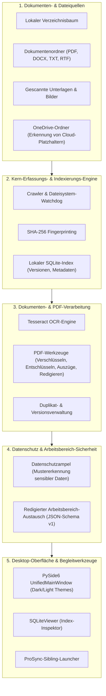
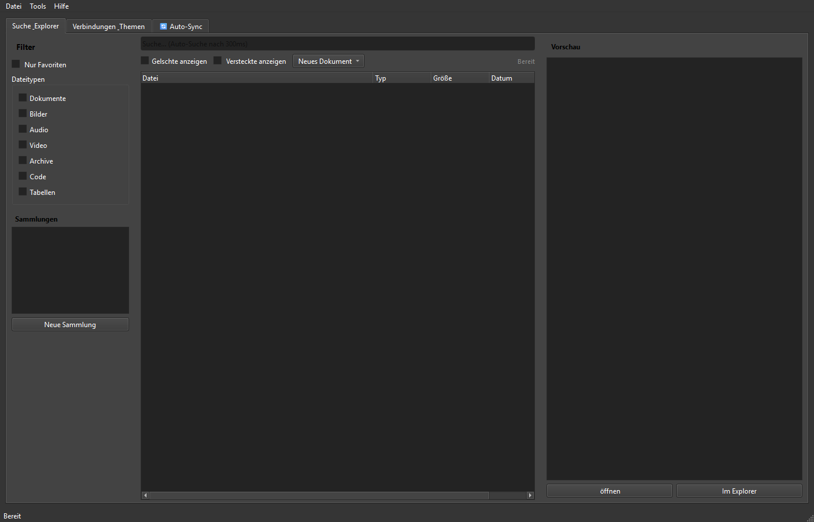

# ProFiler Suite

[English](README.md) | **[Deutsch](README_de.md)** | [GitHub](https://github.com/file-bricks/ProFiler)

[](https://github.com/file-bricks)
[](LICENSE)
[](https://www.python.org/)
[](https://wiki.qt.io/Qt_for_Python)
[]()
[]()
[]()
[](https://github.com/open-bricks)
[](llms.txt)

> [!NOTE]
> KI-Agenten und LLM-Tools, die dieses Repository analysieren, finden in [`llms.txt`](llms.txt) Details zur Architektur, zu primären Features, Vertragsschnittstellen und Verifikationsbefehlen.

> Lokaler Dokumenten-Detektiv — Volltext-Indexierung, OCR, PDF-Werkzeuge, Duplikaterkennung & Datenschutzprüfung in einer PySide6-App.

ProFiler Suite ist ein lokaler Desktop-Dateimanager für private Dokumentensammlungen. Die App verbindet Volltext-Indexierung, OCR, PDF-Werkzeuge, Duplikatenerkennung, Datenschutzprüfungen und eine optionale ProSync-Anbindung in einer Windows-orientierten PySide6-Oberfläche.

ProFiler richtet sich an Menschen, die viele lokale Dokumente verwalten und Suche, Vorschau, PDF-Verarbeitung und Datenschutz-Workflows nutzen möchten, ohne Dateien in einen Cloud-Dienst hochzuladen.

## Architektur



## Highlights

- Lokaler SQLite-Dateiindex für Ordner, Sammlungen und versionierte Dateieinträge
- Volltextsuche über PDF, DOCX, TXT, RTF, Bilder, Tabellen und Code-Dateien
- OCR-Workflow für gescannte PDFs und Bilddokumente mit Tesseract
- PDF-Werkzeuge für Verschlüsselung, Entschlüsselung, Seitenauszüge, OCR, Textextraktion und Export
- Duplikat- und Versionsverwaltung über SHA-256-Dateifingerprints
- Datenschutzampel zum Auffinden potenziell sensibler Dateien vor Weitergabe oder Archivierung
- Erkennung von Cloud-Platzhaltern für OneDrive-ähnliche lokale Bibliotheken
- Optionaler ProSync-Companion für Ordner-Synchronisationsworkflows
- Redigierter Arbeitsstand-Export/-Import für Review, Übergabe und Cross-Platform-Smokes
- Desktop-GUI mit Dark-/Light-Theme und System-Tray-Integration
- Enthaltene Hilfswerkzeuge für SQLite-Prüfung und Excel-Import

## Screenshot



## Wann ProFiler passt

ProFiler ist nützlich für:

- durchsuchbare lokale Archive aus PDFs, Office-Dokumenten, Textdateien und gescannten Unterlagen
- OCR-gestützte Dokumentenindexierung ohne gehosteten SaaS-Dienst
- Dateiaufräumen, Duplikaterkennung und Versionsprüfung über mehrere Ordner
- PDF-Bearbeitung für kleinere Büro-Workflows
- Datenschutzprüfung vor Versand, Export oder Veröffentlichung von Dokumentenpaketen
- eine Desktop-Zentrale neben Werkzeugen wie ProSync und SQLiteViewer

## Schnellstart

```bash
pip install -r requirements.txt
python Profiler_Suite_V15.py
```

Unter Windows kann die App auch so gestartet werden:

```bat
START.bat
```

## Windows-Launcher-EXE

Für die lokale Desktop-Nutzung unter Windows kann eine aktuelle Launcher-EXE so
neu gebaut werden:

```bat
build_exe.bat
```

Der Build verlangt einen sauberen Git-Checkout, läuft außerhalb von OneDrive
unter `C:\_Local_DEV\codex_build\profiler`, nutzt gepinnte
Build-Abhängigkeiten sowie den repository-lokalen Exclude-Scanner und erzeugt:

- `release/ProFiler-15.0.0-win64.exe`
- `release/SHA256SUMS.txt`
- `release/BUILD-PROVENANCE.json`

Der Build kopiert nie automatisch in den Checkout, nach OneDrive, zu GitHub
Releases oder in ein Store-Paket. `START.bat` startet eine lokale EXE nur, wenn
die benachbarte `ProFiler.exe.sha256` passt; ein Quellcheckout verwendet sonst
`Profiler_Suite_V15.py`.

## Voraussetzungen

- Python 3.10+
- PySide6
- Tesseract OCR für OCR-Funktionen
- optionale PDF-/OCR-Bibliotheken aus `requirements.txt`

OCR benötigt [Tesseract](https://github.com/tesseract-ocr/tesseract); die PDF-Bildkonvertierung benötigt zusätzlich Poppler. Beide müssen derzeit im Hostsystem verfügbar sein und werden vom lokalen PyInstaller-Build nicht gebündelt. Store-OCR bleibt deshalb bis zum Paketierungs- und Installations-Smoke blockiert.

Unter Windows liegen lokale App-Daten und Einstellungen jetzt unter `%LOCALAPPDATA%\ProFilerSuite`. Alte lokale Installationen dürfen weiterhin aus `~/.profiler_suite` gelesen werden.

## Konfiguration

| Datei | Zweck |
|---|---|
| `%LOCALAPPDATA%\ProFilerSuite\profiler_config.json` | Laufzeit-Verbindungen und Index-Konfiguration |
| `%LOCALAPPDATA%\ProFilerSuite\profiler_settings.json` | Laufzeit-UI-Einstellungen und optionale Toolpfade |
| `%LOCALAPPDATA%\ProFilerSuite\search_config.json` | Laufzeit-Suchdatenbanken |
| `*.example.json` | Öffentliche, pfadfreie Beispiele; keine Laufzeitdaten |

PDF-Passwörter bleiben ausschließlich in der laufenden Sitzung und werden aus
gespeicherten Einstellungen entfernt. Der optionale Excel-Importer verlangt
explizite Pfade über `--input`, `--database` und `--output`. Eine Bereinigung
erfordert zusätzlich `--cleanup --yes` und einen passenden Eigentumsmarker.

```bash
python -m pip install -e ".[excel]"
python import_excel_to_profiler.py --input EINGABE.xlsx --database profiler.db --output importiert
```

## Enthaltene Werkzeuge

| Tool | Zweck |
|---|---|
| `Profiler_Suite_V15.py` | Hauptanwendung |
| `ProFiler_Datenschutzampel.py` | Eigenständige Datenschutzampel |
| `SQLiteViewer.py` | SQLite-Datenbankviewer für Indexprüfung |
| `import_excel_to_profiler.py` | Excel-Import für bestehende Dateilisten |
| `indent_gui_checker.py` | GUI-Einrückungsprüfung für Wartung |

## Unterstützte Formate

| Kategorie | Formate |
|---|---|
| Dokumente | PDF, DOCX, TXT, RTF |
| Bilder | PNG, JPG, TIFF mit OCR-Unterstützung |
| Tabellen | XLSX, XLS, CSV |
| Weitere Dateien | Indexierung nach Metadaten und Dateikategorie |

## ProFiler und KnowledgeDigest

Wenn du Volltextsuche mit BM25-Ranking, LLM-Zusammenfassungen oder einen Web-Viewer für Dokumente suchst, siehe [KnowledgeDigest](https://github.com/file-bricks/knowledgedigest), eine portable Wissensdatenbank vom selben Autor.

| | ProFiler | KnowledgeDigest |
|---|---|---|
| Fokus | Dateiverwaltung, PDF-Werkzeuge, OCR, Datenschutz | Wissenssuche, Chunking, LLM-Zusammenfassungen |
| Suche | Multi-DB, Typ-/Größen-/Datumsfilter | FTS5 mit BM25-Ranking und Snippets |
| PDF | Verschlüsseln, entschlüsseln, extrahieren, schwärzen, OCR | Read-only-Textextraktion |
| Datenschutz | Anonymisierung, Schwärzung, Clipboard-Schutz | Nicht der Fokus |
| KI | Nicht der Fokus | LLM-Zusammenfassungen und Keyword-Extraktion |
| Oberflächen | Desktop-GUI, System-Tray | Desktop-GUI, Web-Viewer, CLI, Python-API |
| Lizenz | AGPL-3.0 | MIT |

## Ökosystem & Geschwisterwerkzeuge

ProFiler Suite ist Teil der **file-bricks** Desktop-Werkzeugfamilie unter dem Dach von **[open-bricks](https://github.com/open-bricks)**:

| Werkzeug | Repository | Fokus | Status |
|---|---|---|---|
| **ProFiler** | [file-bricks/ProFiler](https://github.com/file-bricks/ProFiler) | Lokale Dokumentenindexierung, OCR, Duplikatenerkennung & Datenschutz | Aktiv |
| **KnowledgeDigest** | [file-bricks/knowledgedigest](https://github.com/file-bricks/knowledgedigest) | Portable Wissensdatenbank, FTS5-BM25-Suche & LLM-Zusammenfassungen | Aktiv |
| **PDFtoPDFocr** | [doc-bricks/PDFtoPDFocr](https://github.com/doc-bricks/PDFtoPDFocr) | Batch-OCR & durchsuchbare PDF-Generierung | Aktiv |
| **DokuZen** | [doc-bricks/DokuZen](https://github.com/doc-bricks/DokuZen) | Desktop-PDF-Werkstatt, Format-Konverter & Sicherheits-Entsperrung | Aktiv |
| **MediaBrain** | [doc-bricks/MediaBrain](https://github.com/doc-bricks/MediaBrain) | Multimodale Medientranskription & strukturierte Indexierung | Aktiv |
| **TextBrain** | [doc-bricks/TextBrain](https://github.com/doc-bricks/TextBrain) | Dokumenten-Intelligenz, semantische Klassifikation & Zusammenfassungen | Aktiv |
| **DevCenter** | [dev-bricks/DevCenter](https://github.com/dev-bricks/DevCenter) | Entwickler-Dashboard & Automations-Zentrale | Aktiv |
| **CodeBox** | [dev-bricks/CodeBox](https://github.com/dev-bricks/CodeBox) | Offline-Snippet-Vault & Code-Runner-Sandbox | Aktiv |

## Datenschutz- und Schwärzungshinweis

ProFiler unterstützt Datenschutz-Workflows, Schwärzung und Anonymisierung, garantiert aber keine vollständige Entfernung sensibler Informationen. Erzeugte Dateien müssen vor Weitergabe oder Veröffentlichung immer manuell geprüft werden.

## Lizenz

ProFiler Suite steht unter AGPL-3.0. Siehe [LICENSE](LICENSE).

Dieses Projekt verwendet unter anderem PySide6 und PyMuPDF; siehe `requirements.txt` und `THIRD_PARTY_LICENSES.txt`.

Die Windows-Store-Basisdokumente liegen in `store_package.json`, `STORE_LISTING.md`, `PRIVACY_POLICY.md`, `SUPPORT.md` und `WINDOWS_STORE_PREP.md`.
