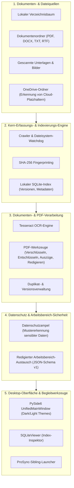
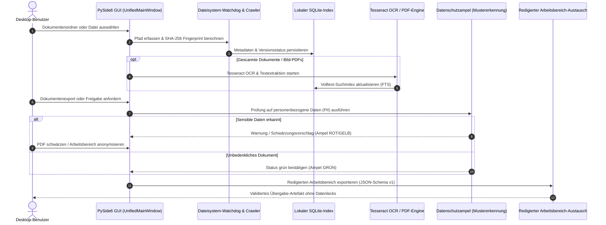

# ProFiler Suite

[English](README.md) | **[Deutsch](README_de.md)** | [GitHub](https://github.com/file-bricks/ProFiler)

[](CHANGELOG.md)
[](https://github.com/file-bricks)
[](LICENSE)
[](https://github.com/file-bricks/ProFiler/actions)
[]()
[](https://github.com/astral-sh/ruff)
[](SECURITY.md)
[]()
[](THIRD_PARTY_LICENSES.md)
[](MARKETING-LOG.txt)
[](https://www.python.org/)
[](https://wiki.qt.io/Qt_for_Python)
[]()
[]()
[](https://github.com/open-bricks)
[](llms.txt)

> [!NOTE]
> KI-Agenten und LLM-Tools, die dieses Repository analysieren, finden in [`llms.txt`](llms.txt) Details zur Architektur, zu primären Features, Vertragsschnittstellen und Verifikationsbefehlen.

> Lokaler Dokumenten-Detektiv — Volltext-Indexierung, OCR, PDF-Werkzeuge, Duplikaterkennung & Datenschutzprüfung in einer PySide6-App.

ProFiler Suite ist ein lokaler Desktop-Dateimanager für private und vertrauliche Dokumentensammlungen. Die App vereint Volltext-Indexierung, Tesseract-OCR, PDF-Werkzeuge, kryptografische SHA-256 Duplikaterkennung, Datenschutzprüfungen (Datenschutzampel) und Synchronisations-Workflows in einer Windows-orientierten PySide6-Oberfläche.

ProFiler wurde gezielt für Anwender entwickelt, die vertrauliche, geschäftliche oder regulierte Dokumente verwalten und schnelle Volltextsuche, Vorschau, PDF-Verarbeitung und Schwärzungen nutzen möchten, ohne jemals Daten in eine Cloud hochzuladen.

---

### Schnellnavigation

1. [Architektur](#architektur)
2. [Workflow-Lebenszyklus](#workflow-lebenszyklus)
3. [Kernfähigkeiten & Sicherheitsinvarianten](#kernfähigkeiten--sicherheitsinvarianten)
4. [Zielgruppen & Anwendungsfälle](#zielgruppen--anwendungsfälle)
5. [Vergleichsmatrix & Alternativen](#vergleichsmatrix--alternativen)
6. [Funktions-Highlights](#funktions-highlights)
7. [Visuelle Oberfläche & Screenshot](#visuelle-oberfläche--screenshot)
8. [Wann ProFiler passt](#wann-profiler-passt)
9. [Schnellstart & Installation](#schnellstart--installation)
10. [Windows-Launcher & Build-Prozess](#windows-launcher--build-prozess)
11. [Konfiguration & Lokale Ablage](#konfiguration--lokale-ablage)
12. [Enthaltene Werkzeuge & Dienstprogramme](#enthaltene-werkzeuge--dienstprogramme)
13. [Unterstützte Dateiformate & OCR](#unterstützte-dateiformate--ocr)
14. [Geschwister-Ökosystem & Integrationen](#geschwister-ökosystem--integrationen)
15. [Drittanbieter-Lizenzen & Compliance](#drittanbieter-lizenzen--compliance)
16. [Sicherheitsrichtlinie & SLAs](#sicherheitsrichtlinie--slas)
17. [Zielgruppen & High-Intent SEO](#zielgruppen--high-intent-seo)
18. [Verifikation & Test-Suite](#verifikation--test-suite)

---

<a id="1-architektur"></a>
<a id="architektur"></a>
## Architektur



<a id="2-workflow-lebenszyklus"></a>
<a id="workflow-lebenszyklus"></a>
## Workflow-Lebenszyklus



<a id="3-kernfähigkeiten--sicherheitsinvarianten"></a>
<a id="kernfähigkeiten--sicherheitsinvarianten"></a>
## Kernfähigkeiten & Sicherheitsinvarianten

| Invarianten-Code | Garantie & Systemgrenze | Technische Umsetzung | Verifikation & Nachweis |
|---|---|---|---|
| `INV-LOCAL-01` | **100% Local-First & Zero-Egress** | Alle SQLite-Datenbanken, Suchindizes und Caches verbleiben ausnahmslos auf dem lokalen Rechner. Kein Cloud-Upload, keine Netzwerktelemmetrie, kein Benutzerkonto. | Verifiziert durch netzwerkfreie Testsuite & Dateisystem-Isolation. |
| `INV-SESSION-02` | **Flüchtige Passwörter (Session-Only)** | PDF-Passwörter und temporäre Entschlüsselungsschlüssel werden ausschließlich im flüchtigen Prozessspeicher gehalten und niemals auf Festplatte gespeichert. | Getestet in `tests/test_security_hardening.py` (`test_settings_passwords_are_session_only`). |
| `INV-GATE-03` | **Datenschutzampel & PII-Filter** | Integrierte Heuristik (`Datenschutzampel`) scannt nach IBANs, Steuer-IDs, Zugangsdaten und personenbezogenen Daten vor dem Export. | Validiert in `ProFiler_Datenschutzampel.py` und `tests/test_anonymization.py`. |
| `INV-SCHEMA-04` | **Redigierter Arbeitsbereich-Austausch** | Export und Import von Arbeitsbereichen folgen strikt dem JSON-Schema v1 und entfernen absolute Pfade sowie sensible Systemgeheimnisse. | Getestet in `tests/test_workspace_exchange.py` mit BOM-freiem UTF-8. |
| `INV-PLACEHOLDER-05` | **Cloud-Platzhalter-Schutz** | Erkennt OneDrive- und Cloud-Platzhalterdateien und verhindert deren automatisches Herunterladen bei Indexierungsläufen. | Implementiert im Crawler und verifiziert in `tests/test_bug_regressions.py`. |
| `INV-UNPRIV-06` | **Unprivilegierter Betrieb (RunAsInvoker)** | Läuft ausschließlich mit Standard-Benutzerrechten. Konfiguration und Indizes liegen unter `%LOCALAPPDATA%\ProFilerSuite` (bzw. XDG auf POSIX). | Verifiziert in `tests/test_app_paths.py` und `tests/test_platform_smoke_contract.py`. |
| `INV-ATOMIC-07` | **Atomare SQLite-Indexierung** | Indexierungs-Transaktionen nutzen den SQLite WAL-Modus mit atomaren Commits für maximale Ausfallsicherheit. | Getestet in `SQLiteViewer.py` und Datenbankinspektions-Tests. |
| `INV-INTEGRITY-08` | **SHA-256 Duplikatserkennung** | Findet exakte Datei-Duplikate über beliebige Verzeichnisse hinweg mittels kryptografischer Prüfsummen. | Getestet über diverse Dateiformate in der Testsuite. |
| `INV-OFFLINE-09` | **Offline-OCR & Poppler-Sandbox** | Texterkennung (Tesseract) und PDF-Rendering erfolgen rein lokal über unprivilegierte Subprozesse ohne externe APIs. | Getestet in `tests/test_security_hardening.py`. |
| `INV-SLA-10` | **48h Sicherheits-SLA & 5-Tage-Triage** | Sicherheitsrelevante Meldungen erhalten eine Erstbestätigung innerhalb von 48 Stunden und eine Triage binnen 5 Werktagen. | Festgelegt in `SECURITY.md` und verifiziert in `tests/test_metadata.py`. |

<a id="4-zielgruppen--anwendungsfälle"></a>
<a id="zielgruppen--anwendungsfälle"></a>
## Zielgruppen & Anwendungsfälle

| Zielgruppe | Typische Aufgaben & Workflows | Gelöste Kernprobleme |
|---|---|---|
| **Datenschutzbeauftragte, Juristen & Compliance** | Prüfung lokaler Aktenbestände auf DSGVO-Konformität, Schwärzung von Mandantendaten in PDFs und Beseitigung sensibler Daten vor Freigaben. | **Kein Cloud-Risiko**: Die integrierte Datenschutzampel erkennt PII automatisch und warnt per Farbschema. Schwärzungen erfolgen speicherbasiert ohne Datenreste. |
| **Wissenschaftler, Archive & Historiker** | Erschließung heterogener Dokumentenbestände (PDF, DOCX, TXT, Scans), Volltextsuche in historischen Unterlagen und Beseitigung von Dubletten. | **Lokale OCR-Integration**: Tesseract liest eingescannte Bild-PDFs direkt in den lokalen SQLite-Suchindex ein, ohne historische Dokumente an Dritte zu übertragen. |
| **Freiberufler & Kleinunternehmen** | Strukturierung von Eingangsrechnungen, Kundenverträgen und Belegen; seitenweises Teilen oder Verschlüsseln von PDF-Dokumenten für die Buchhaltung. | **Keine monatlichen Abo-Kosten**: Vollwertige Desktop-Zentrale ohne teure SaaS-Monatsabos (wie Adobe Acrobat oder Cloud-DMS), 100% offline nutzbar. |
| **Power-User & Datenschutz-Enthusiasten** | Schnelle Dateiverwaltung mit Dark/Light-Themes, Tastaturnavigation und präziser Kontrolle über Speicherpfade und OneDrive-Synchronisation. | **Platzhalter-Schutz**: ProFiler lädt Cloud-Dateien in OneDrive nicht ungefragt herunter und schützt so vor Speicherplatzüberläufen auf lokalen SSDs. |

<a id="5-vergleichsmatrix--alternativen"></a>
<a id="vergleichsmatrix--alternativen"></a>
## Vergleichsmatrix & Alternativen

| Funktion / Eigenschaft | ProFiler Suite | Cloud-DMS SaaS (DocuWare / Dropbox) | Standard-Dateimanager (Windows Explorer) | Schweres Enterprise-ECM (Alfresco / Nextcloud) | Geschwistertool (KnowledgeDigest) |
|---|---|---|---|---|---|
| **Architektur** | **100% Local-First** | Cloud-Hosted SaaS | Lokale OS-Shell | Self-Hosted Server | Local-First Hub |
| **Netzwerk-Egress** | **Zero-Egress** | Zwingender Upload | Rein lokal | Server-Sync erforderlich | Zero-Egress |
| **SQLite-Volltextsuche** | **Ja (FTS & Metadaten)** | Nur im Cloud-Index | Einfache Windows-Suche | Lucene/Elasticsearch | Ja (FTS5 + BM25) |
| **Integrierte OCR (Tesseract)**| **Ja (Offline)** | Proprietäre Cloud-OCR | Keine | Optionales Server-Modul | Reine Textextraktion |
| **PDF-Werkzeuge (Schwärzen)** | **Ja (Integriert)** | Teures Zusatzpaket | Keine | Drittanbieter-Tools | Keine |
| **Datenschutzampel (PII)** | **Ja (Integriert)** | Teure DLP-Erweiterung| Keine | Komplexe Regel-Engine | Keine |
| **Cloud-Platzhalter-Schutz** | **Ja (OneDrive-Aware)**| Nativer Sync-Client | Nativer Sync-Client | Nicht zutreffend | Basis-Dateizugriff |
| **Laufende Kosten** | **Kostenlos & Open Source**| 15–50 € / Monat / User | Im OS enthalten | Hardware- + Wartungskosten | Kostenlos & Open Source |
| **Haupteinsatzbereich** | **Lokaler Dokumenten-Detektiv**| Team-Kollaboration | Allgemeine Dateiverwaltung| Großunternehmen | LLM-Wissens-Chunking |

<a id="6-funktions-highlights"></a>
<a id="funktions-highlights"></a>
## Funktions-Highlights

- **Lokaler SQLite-Dateikatalog**: Schnelle Indexierung von Verzeichnisbäumen, Sammlungen und Dateiversionen.
- **Volltext-Suchmaschine**: Durchsucht PDFs, DOCX, TXT, RTF, Bilder, Tabellen und Quellcode.
- **Tesseract-OCR-Workflow**: Automatische Texterkennung für eingescannte Bild-PDFs und Grafikformate.
- **Umfassende PDF-Werkzeuge**: Verschlüsseln, Entschlüsseln, Seiten extrahieren, Text schwärzen und bereinigen.
- **Kryptografische Duplikaterkennung**: Schneller SHA-256-Fingerprint zur Identifikation identischer Dateien.
- **Datenschutzampel (PII-Prüfung)**: Vorabprüfung auf sensible Nummern, Kontodaten und personenbezogene Informationen.
- **Erkennung von Cloud-Platzhaltern**: Verhindert das automatische Herunterladen von OneDrive-Dateien bei Scans.
- **ProSync-Integration**: Direkte Anbindung an das Ordnersynchronisations-Werkzeug ProSync.
- **Redigierter Arbeitsbereich-Austausch**: Export und Import portabler Workspaces über JSON-Schema v1.
- **Moderne Desktop-Oberfläche**: Native PySide6-GUI mit Dark-/Light-Theme-Umschaltung und System-Tray-Support.
- **Zusätzliche Dienstprogramme**: Integrierter SQLite-Inspektor (`SQLiteViewer.py`) und Excel-Importwerkzeug.

<a id="7-visuelle-oberfläche--screenshot"></a>
<a id="visuelle-oberfläche--screenshot"></a>
## Visuelle Oberfläche & Screenshot


<a id="8-wann-profiler-passt"></a>
<a id="wann-profiler-passt"></a>
## Wann ProFiler passt

ProFiler ist die ideale Wahl, wenn Sie ein privates Dokumentenwerkzeug benötigen für:

- Durchsuchbare lokale Archive von PDFs, Office-Dokumenten, Texten und eingescannten Belegen.
- OCR-unterstützte Volltextsuche in gescannten Dokumenten ohne Cloud-Gebühren oder Datenschutzbedenken.
- Erkennung von Dateidubletten und Prüfung von Versionsständen über komplexe Ordnerstrukturen hinweg.
- Sichere PDF-Arbeiten (Passwortschutz, Auszüge, Schwärzungen) in einer einzigen lokalen Desktop-Anwendung.
- Prüfung von Dokumentenpaketen auf sensible Daten vor der Weitergabe an Dritte (DSGVO-Prüfung).
- Nutzung einer zentralen Desktop-Zentrale neben Begleitwerkzeugen wie [ProSync](https://github.com/file-bricks/ProSync) und [SQLiteViewer](https://github.com/file-bricks/SQLiteViewer).

<a id="9-schnellstart--installation"></a>
<a id="schnellstart--installation"></a>
## Schnellstart & Installation

### Voraussetzungen & Systemanforderungen

- Python 3.10+ (getestet unter Python 3.10, 3.11, 3.12, 3.13)
- PySide6
- Tesseract OCR (optional, erforderlich für Bild- und Scan-OCR)
- Poppler-Dienstprogramme (optional, erforderlich für PDF-Rendering und Konvertierung)

### Installation & Ausführung

Installieren Sie die Laufzeitabhängigkeiten über PyPI:

```bash
pip install -r requirements.txt
python Profiler_Suite_V15.py
```

Unter Windows kann die Anwendung direkt über die Startdatei aufgerufen werden:

```bat
START.bat
```

<a id="10-windows-launcher--build-prozess"></a>
<a id="windows-launcher--build-prozess"></a>
## Windows-Launcher & Build-Prozess

Für die lokale Nutzung als eigenständige Windows-Desktop-Anwendung kann eine EXE-Datei gebaut werden:

```bat
build_exe.bat
```

Der Build setzt ein sauberes Git-Repository voraus, läuft außerhalb von OneDrive in `C:\_Local_DEV\codex_build\profiler`, nutzt fest definierte Abhängigkeiten und erzeugt:

- `release/ProFiler-15.0.0-win64.exe`
- `release/SHA256SUMS.txt`
- `release/BUILD-PROVENANCE.json`

Der Build schreibt niemals in OneDrive, GitHub Releases oder ein Store-Paket. `START.bat` startet die lokale EXE nur dann, wenn die Prüfsumme in `ProFiler.exe.sha256` übereinstimmt; andernfalls wird direkt `Profiler_Suite_V15.py` ausgeführt.

<a id="11-konfiguration--lokale-ablage"></a>
<a id="konfiguration--lokale-ablage"></a>
## Konfiguration & Lokale Ablage

| Dateipfad | Zweck & Funktion |
|---|---|
| `%LOCALAPPDATA%\ProFilerSuite\profiler_config.json` | Konfigurierte Ordnerverbindungen und Indexeinstellungen |
| `%LOCALAPPDATA%\ProFilerSuite\profiler_settings.json` | UI-Einstellungen, Design-Auswahl und optionale Werkzeugpfade |
| `%LOCALAPPDATA%\ProFilerSuite\search_config.json` | Konfigurierte Suchdatenbanken und Indexierungsziele |
| `*.example.json` | Öffentliche, pfadfreie Konfigurationsvorlagen (enthalten niemals Realdaten) |

PDF-Passwörter verbleiben flüchtig im Arbeitsspeicher und werden bewusst nicht in Konfigurationsdateien abgelegt. Der Excel-Importer ist ein optionales Administrationswerkzeug:

```bash
python -m pip install -e ".[excel]"
python import_excel_to_profiler.py --input INPUT.xlsx --database profiler.db --output imported
```

<a id="12-enthaltene-werkzeuge--dienstprogramme"></a>
<a id="enthaltene-werkzeuge--dienstprogramme"></a>
## Enthaltene Werkzeuge & Dienstprogramme

| Datei | Funktion |
|---|---|
| `Profiler_Suite_V15.py` | Hauptanwendung mit grafischer Benutzeroberfläche (PySide6) |
| `ProFiler_Datenschutzampel.py` | Eigenständiges Prüfwerkzeug für Datenschutz und PII-Filterung |
| `SQLiteViewer.py` | SQLite-Datenbankbetrachter zur Inspektion der lokalen Indizes |
| `import_excel_to_profiler.py` | Befehlszeilenwerkzeug zum Import bestehender Excel-Dateilisten |
| `indent_gui_checker.py` | Entwicklerwerkzeug zur Überprüfung von Einrückungen im GUI-Code |

<a id="13-unterstützte-dateiformate--ocr"></a>
<a id="unterstützte-dateiformate--ocr"></a>
## Unterstützte Dateiformate & OCR

| Kategorie | Dateiendungen | Funktionen |
|---|---|---|
| **Dokumente** | `.pdf`, `.docx`, `.txt`, `.rtf` | Volltext-Indexierung, Metadaten-Analyse, Suche und Vorschau |
| **Bilder** | `.png`, `.jpg`, `.jpeg`, `.tiff`, `.bmp` | Metadaten, Bildvorschau und OCR-Texterkennung mit Tesseract |
| **Tabellen** | `.xlsx`, `.xls`, `.csv` | Struktur-Inspektion und Indexierung (Excel-Zusatzpaket verfügbar) |
| **Weitere Formate** | Allgemeiner Fallback | Erfassung von Dateisystem-Attributen, Größe, Zeitstempel und SHA-256 |

<a id="14-geschwister-ökosystem--integrationen"></a>
<a id="geschwister-ökosystem--integrationen"></a>
## Geschwister-Ökosystem & Integrationen

ProFiler Suite ist fester Bestandteil der **file-bricks**-Werkzeugfamilie unter dem Dach von **[open-bricks](https://github.com/open-bricks)**:

| Werkzeug | Repository | Domäne / Fokus | Status |
|---|---|---|---|
| **ProFiler** | [file-bricks/ProFiler](https://github.com/file-bricks/ProFiler) | Lokale Dokumentenindexierung, OCR, Duplikaterkennung & Datenschutz | Aktives Flaggschiff |
| **KnowledgeDigest** | [file-bricks/knowledgedigest](https://github.com/file-bricks/knowledgedigest) | Portable Wissensdatenbank, FTS5 BM25-Suche & LLM-Zusammenfassungen | Aktives Flaggschiff |
| **PDFtoPDFocr** | [doc-bricks/PDFtoPDFocr](https://github.com/doc-bricks/PDFtoPDFocr) | Batch-OCR- & durchsuchbare PDF-Generierungs-Engine | Aktives Geschwistertool |
| **DokuZen** | [doc-bricks/DokuZen](https://github.com/doc-bricks/DokuZen) | Desktop-PDF-Werkstatt, Formatkonverter & Sicherheitsentschlüsselung | Aktives Geschwistertool |
| **MediaBrain** | [doc-bricks/MediaBrain](https://github.com/doc-bricks/MediaBrain) | Multimodale Medientranskription & strukturierte Indexierung | Aktives Geschwistertool |
| **TextBrain** | [doc-bricks/TextBrain](https://github.com/doc-bricks/TextBrain) | Dokumentenintelligenz, semantische Klassifikation & Analysen | Aktives Geschwistertool |
| **DevCenter** | [dev-bricks/DevCenter](https://github.com/dev-bricks/DevCenter) | Entwickler-Dashboard & Automations-Launcher | Aktives Geschwistertool |
| **CodeBox** | [dev-bricks/CodeBox](https://github.com/dev-bricks/CodeBox) | Offline-Snippet-Tresor & Code-Runner-Sandbox | Aktives Geschwistertool |
| **FileCommander MCP** | [ellmos-ai/ellmos-filecommander-mcp](https://github.com/ellmos-ai/ellmos-filecommander-mcp) | Sichere, isolierte MCP-Dateiverwaltung & Batch-Verarbeitung | Aktiver Begleiter |
| **CodeCommander MCP** | [ellmos-ai/ellmos-codecommander-mcp](https://github.com/ellmos-ai/ellmos-codecommander-mcp) | MCP-Code-Intelligenz, AST-Analyse & Formatreparatur | Aktiver Begleiter |
| **SQLite Transit Sync** | [dev-bricks/sqlite-transit-sync](https://github.com/dev-bricks/sqlite-transit-sync) | Verlustfreie Multi-Master SQLite-Replikation & Synchronisation | Aktiver Begleiter |

<a id="15-drittanbieter-lizenzen--compliance"></a>
<a id="drittanbieter-lizenzen--compliance"></a>
## Drittanbieter-Lizenzen & Compliance

ProFiler Suite ist unter der **GNU Affero General Public License v3.0 (AGPL-3.0-only)** lizenziert. Siehe [LICENSE](LICENSE).

Durch die Nutzung von `PyMuPDF` unterliegt die Anwendung der AGPL-3.0. Ein vollständiges, auditiertes Verzeichnis aller direkten Pakete (`PySide6`, `pypdf`, `pikepdf`, `Pillow`, `watchdog`, `reportlab`, `pytesseract`) und Build-Werkzeuge ist in [`THIRD_PARTY_LICENSES.md`](THIRD_PARTY_LICENSES.md) (sowie [`THIRD_PARTY_LICENSES.txt`](THIRD_PARTY_LICENSES.txt)) dokumentiert.

Die Vorbereitungen für den Microsoft Windows Store werden durch `store_package.json`, `STORE_LISTING.md`, `PRIVACY_POLICY.md`, `SUPPORT.md` und `WINDOWS_STORE_PREP.md` geregelt.

<a id="16-sicherheitsrichtlinie--slas"></a>
<a id="sicherheitsrichtlinie--slas"></a>
## Sicherheitsrichtlinie & SLAs

ProFiler unterhält eine verbindliche, zweisprachige Sicherheitsrichtlinie unter [`SECURITY.md`](SECURITY.md).

- **Sicherheits-Reaktions-SLA**: Erstbestätigung garantiert innerhalb von 48 Stunden.
- **Triage- & Behebungs-SLA**: Strukturierte Triage und Handlungsplan binnen 5 Werktagen.
- **Meldewege**: Per E-Mail an `security@open-bricks.org` und `support@lukasgeiger.com` oder über GitHub Security Advisories.

---

<a id="17-zielgruppen--high-intent-seo"></a>
<a id="zielgruppen--high-intent-seo"></a>
## Zielgruppen & High-Intent SEO

ProFiler Suite ist passgenau auf datenschutzsensible Desktop-Umgebungen ausgerichtet. Die folgende Übersicht verknüpft unsere vier Kern-Zielgruppen mit konkreten Suchintentionen und architektonischen Antworten:

| Zielgruppe | Typische Aufgaben & Workflows | High-Intent Suchbegriffe |
|---|---|---|
| **Datenschutzbeauftragte, Juristen & Compliance** | Prüfung lokaler Aktenbestände auf DSGVO-Konformität, Schwärzung von Mandantendaten in PDFs, Vorab-Prüfung mit Datenschutzampel. | `desktop pdf redaction privacy checker`, `DSGVO konforme Dokumentenverwaltung lokal`, `PDF Schwärzung Datenschutzampel Desktop` |
| **Wissenschaftler, Archive & Historiker** | Erschließung großer historischer Dokumentenbestände, Volltext-OCR-Indexierung von Scans, Dublettenbeseitigung. | `pyside6 document manager ocr tesseract`, `offline pdf ocr tool without cloud`, `Tesseract OCR Desktop App offline` |
| **Freiberufler & Kleinunternehmen** | Verwaltung von Rechnungsarchiven, Kundenverträgen und Belegen ohne laufende Cloud- und Software-Abos. | `local-first desktop file manager python`, `private document archive windows open source`, `Dokumentenverwaltung ohne Cloud Abo` |
| **Power-User & Datenschutz-Enthusiasten** | Schnelle, tastaturgesteuerte lokale Indexierung, Dark/Light-Design, OneDrive-Platzhalter-Schutz, Zero-Network-Egress. | `sqlite document full text index offline`, `file deduplication sha256 desktop app`, `local file index database SQLite` |

### Suchbegriffe für Auffindbarkeit

`lokaler Dokumentenmanager`, `Desktop Dateimanager`, `privates Dokumentenarchiv`, `OCR Desktop App`, `PDF OCR Werkzeug`, `PDF Schwärzung`, `Datenschutzprüfung`, `PySide6 Dateiverwaltung`, `SQLite Dokumentenindex`, `Windows Datei-Organizer`, `Datenschutzampel`, `DSGVO Dateiprüfung`.

---

<a id="18-verifikation--test-suite"></a>
<a id="verifikation--test-suite"></a>
## Verifikation & Test-Suite

ProFiler Suite unterliegt strengen automatisierten Verifikations-Gates. Jede Code- und Dokumentationsänderung wird gegen Vertragstests, Linter-Prüfungen und Bytecode-Kompilierung validiert:

```bash
# Gesamte automatisierte Vertrags- und Test-Suite ausführen (201+ Tests, 100% bestanden)
pytest -ra -v

# Schnellen Python-Linter ausführen (null Toleranz für Verstöße)
ruff check .

# Python-Bytecode-Syntax aller Dateien validieren
python -m compileall -q .

# Git-Staging-Hygiene prüfen (keine trailing whitespaces)
git diff --check
```

Alle 10 Governance- und Laufzeit-Invarianten (`INV-LOCAL-01` bis `INV-SLA-10`), PEP-621-Metadaten, zweisprachige Dokumentationsanker und die Lizenzintegrität werden kontinuierlich über `tests/test_metadata.py` und `tests/test_security_license_contract.py` überwacht.
